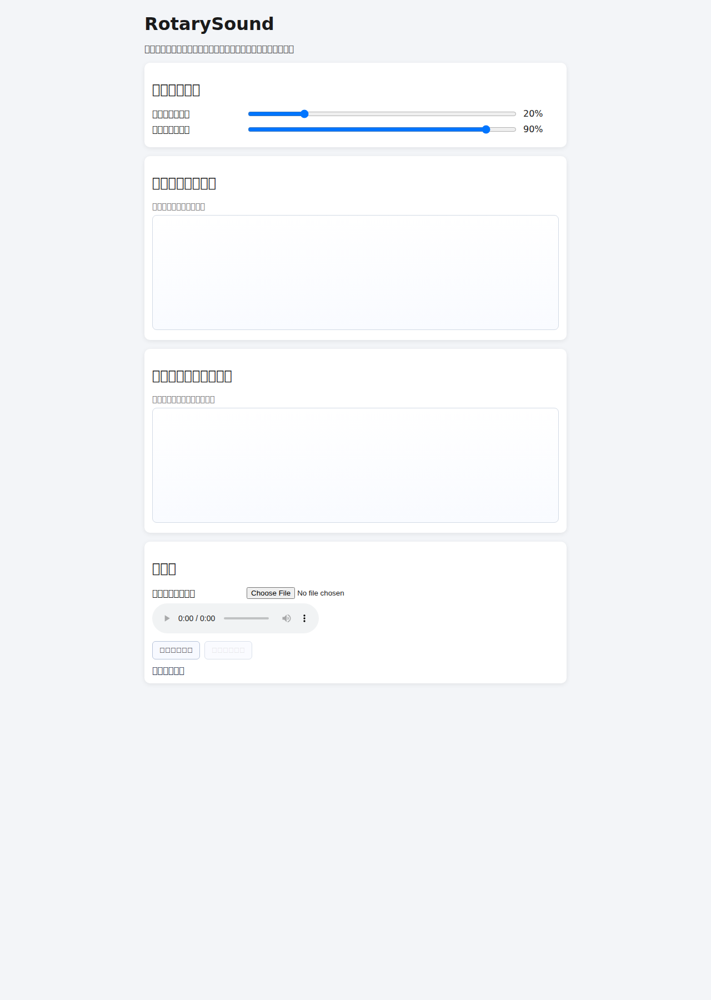

# RotarySound

一个便携式网页工具，用于对本地音频做“旋转”处理（立体声左右摆动），并提供：

- 原音量最小百分比（全局下限）
- 原音量最大百分比（全局上限）
- 旋转速度节奏可视化曲线调整器
- 旋转时音量变化幅度可视化曲线调整器

## 使用方式

1. 直接打开 `index.html`
2. 选择本地音频文件
3. 调整最小/最大音量百分比
4. 拖动两条曲线调整旋转速度和音量变化幅度
5. 点击“开始旋转处理”

## 开发测试

```bash
npm test
```

## 界面预览


